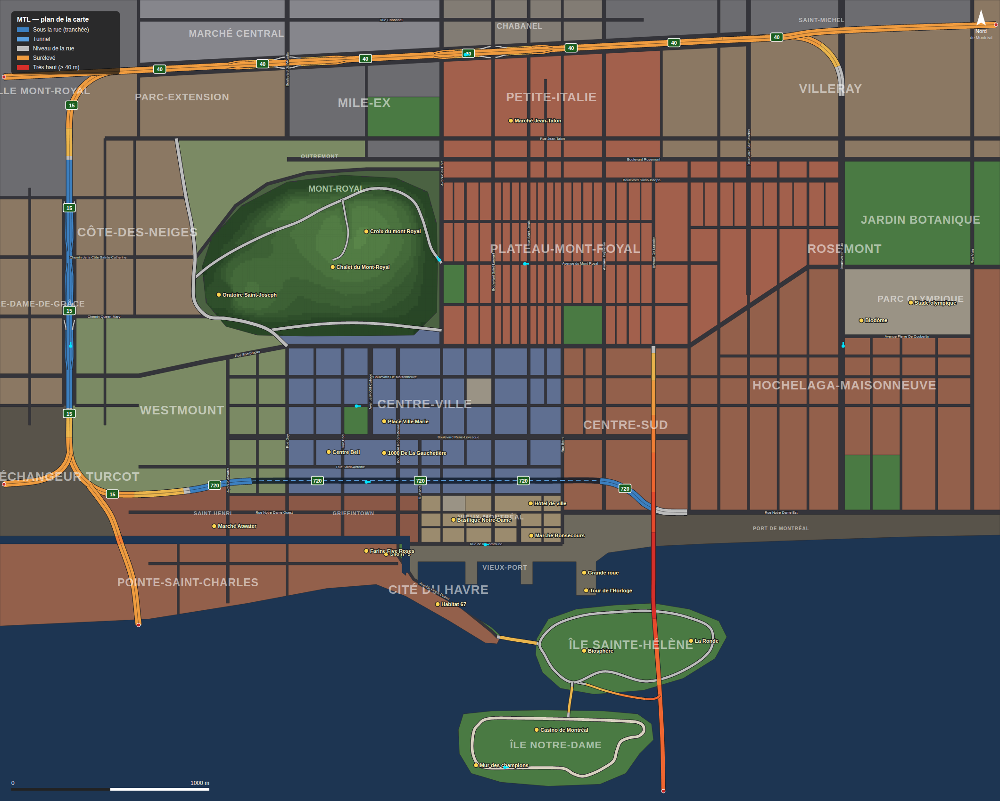

# MTL — une Montréal compacte pour un jeu de course

Carte de monde ouvert inspirée de Montréal, pour un jeu de course de rue façon
*Need for Speed Underground*. Ce n'est pas toute la ville : ce sont des quartiers
reconnaissables, rapprochés environ trois fois, reliés par une boucle
d'autoroutes.



## Lancer

```bash
cd mtl && python3 -m http.server 8080     # puis http://localhost:8080
```

Pas de build ni de `npm install` : three.js est dans `vendor/`.

| Touche | Action |
|---|---|
| WASD / flèches | conduire (manette et tactile aussi) |
| Espace | frein à main |
| R | replacer sur la route |
| C | caméra (poursuite, lointaine, capot) |
| M | grande carte ; un clic y téléporte |
| N | nuit / jour |
| F | vol libre au-dessus de la carte |
| E | exporter pour Unity (.glb par zone + map.json) |

Paramètres d'URL : `?spawn=decarie|metropolitaine|tunnel|plateau|camillien-houde|stade|circuit|vieux-port|sainte-catherine`,
`?day=1`, `?low=1` (réglages téléphone), `?cam=x,n,h,tx,tn,th` (vol libre).

## Ce qu'il y a dedans

- **La boucle** (≈ 9,5 km) : la Métropolitaine (A-40) surélevée à 10 m,
  l'échangeur Décarie, la **tranchée Décarie** à −8 m avec ses bretelles et ses
  rues qui passent par-dessus, Turcot, l'A-720 et le **tunnel Ville-Marie**
  sous le centre-ville, puis Notre-Dame Est et Pie-IX.
- **Quartiers** : centre-ville, Vieux-Montréal, Vieux-Port, Plateau (avec ses
  ruelles), Centre-Sud, Hochelaga, Rosemont, Petite-Italie, Mile-Ex,
  Villeray, Outremont, Côte-des-Neiges, NDG, Westmount, Saint-Henri,
  Griffintown, Pointe-Saint-Charles, Parc-Ex et d'autres.
- **Le mont Royal** et ses routes : Camillien-Houde, Remembrance, chemin du
  Chalet, avenue des Pins, Côte-des-Neiges.
- **Les îles** : pont Jacques-Cartier, pont de la Concorde, circuit
  Gilles-Villeneuve, Biosphère, La Ronde, casino.
- **22 repères** modélisés : PVM et ses projecteurs, la croix, le Stade et sa
  tour, Five Roses, Silo n° 5, Habitat 67, basilique, Centre Bell…
- **5 courses** esquissées dans les données, dont le tour de la boucle et
  Camillien-Houde.

## Comment c'est fait

Tout part de `src/map/montreal.js`, un fichier de données écrit à la main.
Le reste en est **dérivé** : profils verticaux des routes, trous de la tranchée,
murs, glissières, piliers, plafonds du tunnel, îlots, bâtiments procéduraux,
lampadaires, arbres, marquage. Rien de tout ça n'est posé à la main, donc
déplacer une rue dans les données met tout le reste à jour.

| Dossier | Rôle |
|---|---|
| `src/map/` | logique pure, sans three.js : données, compilation, validation, structures, surfaces, collisions |
| `src/world/` | maillages three.js (reçoivent `THREE` en paramètre) |
| `src/game/` | conduite (physique de Ruelle à 120 Hz), caméra, entrées, HUD, son |
| `src/export/` | export glTF par zone et `map.json` |
| `tools/` | contrôles, captures, plan, export |

## Contrôles avant de commiter

```bash
node mtl/tools/check.mjs             # ~5 s : validation + conduite automatique
node mtl/tools/check.mjs --browser   # + la vraie page dans Chromium headless
node mtl/tools/shots.mjs             # captures de vues fixes → mtl/.shots/
node mtl/tools/plan.mjs --png        # régénère docs/plan.png
node mtl/tools/export.mjs            # export Unity → mtl/export/
```

`check.mjs` fait rouler un pilote automatique sur la boucle complète dans les
deux sens, sur les routes de la montagne, sur le pont et sur le circuit. Il
compte chaque choc, chaque saut et chaque écart vertical. Il vérifie aussi
qu'aucun repère ne déborde sur une rue.

## Limites connues

- **Tracée à la main, pas depuis OpenStreetMap** : l'accès à Overpass était
  bloqué par le réseau de l'environnement. Les positions relatives sont
  justes, les formes sont simplifiées.
- La montagne est plus basse que la vraie (72 m au lieu de ~200), pour garder
  des pentes de 10 % au plus.
- Les fenêtres sont une texture procédurale : correctes de loin, simplistes de
  près.
- Pas encore de trafic, de piétons, ni de course jouable (les données y sont).
