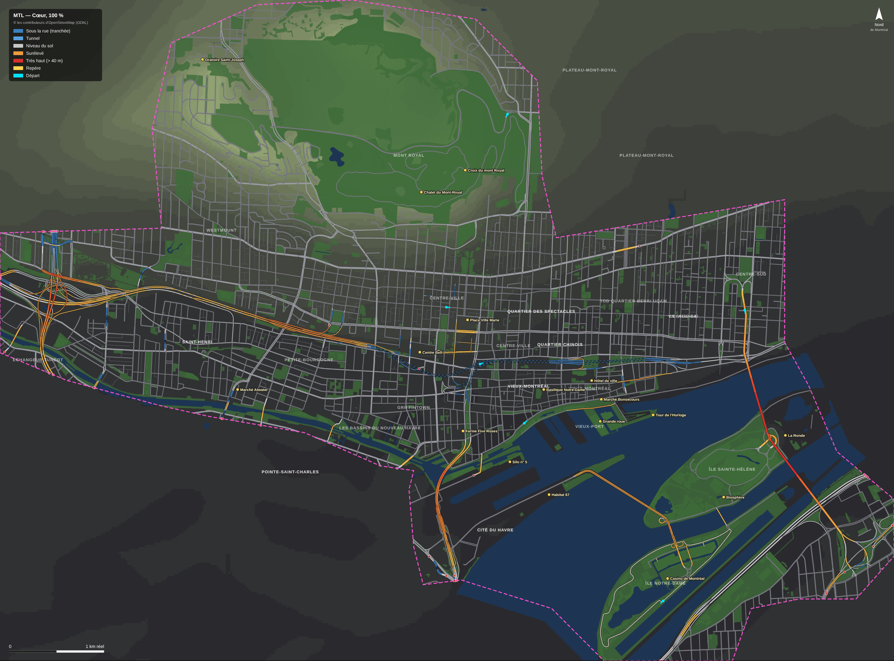

# MTL — la vraie Montréal pour un jeu de course

Carte de monde ouvert pour un jeu de course de rue façon *Need for Speed
Underground*, construite sur les **vraies données** de Montréal :
OpenStreetMap (via Overture Maps) pour les rues, autoroutes, bâtiments, eau,
parcs et arbres, et le relief réel (tuiles Terrarium). Rien n'est tracé à la
main sauf quelques repères, les points de départ et les styles de quartier.



## Lancer

```bash
cd mtl && python3 -m http.server 8080     # puis http://localhost:8080
```

Pas de build ni de `npm install` : three.js est dans `vendor/`, les données
dans `data/` (≈ 13 Mo).

## Zone et échelle

Deux réglages, dans le bouton **Carte…** en haut (la page se reconstruit) :

| Zone | Contenu |
|---|---|
| `coeur` (par défaut) | la carte de jeu : centre-ville, Vieux-Montréal, Vieux-Port, mont Royal, Saint-Henri, Turcot, les îles, la tête du pont Jacques-Cartier à Longueuil (36 km²) |
| `centre` | centre-ville, Vieux-Montréal, Vieux-Port, Plateau, mont Royal, Ville-Marie, les îles (~7 × 7 km) |
| `anneau` | le centre, plus Décarie, la Métropolitaine (A-40), Turcot, le Stade (~12 × 11 km) |

`coeur` est un polygone, pas un rectangle : une forme qu'on lit d'un coup
d'œil, comme la carte d'un monde ouvert. Le fleuve au sud et à l'est, le mont
Royal au nord, Turcot à l'ouest, le canal de Lachine sous Saint-Henri. Les
ponts qui mènent aux îles et à la rive sud restent entiers ; ceux qui sortent
de la carte (Victoria, Champlain par Bonaventure) s'arrêtent sur une barrière.
Décarie, la 40 et le Stade n'y sont pas : ils restent dans `anneau`.

**Échelle** : 100 % (la vraie ville), 85 % ou 70 %. En dessous de 100 %,
tout rapetisse d'autant — rues, bâtiments, relief — sauf la voiture et les
dégagements sous les ponts et dans les tunnels, qui restent en vrais mètres.

La valeur de départ est dans `carte.json` ; l'adresse la remplace :
`?zone=centre&echelle=85` (ou `#centre-85`).

### Dessiner sa propre zone

`zones.html` (lien « Dessiner ma zone… » dans **Carte…**) : un plan des rues,
de l'eau et des parcs, sur lequel on trace la zone à jouer — polygone (un clic
par sommet, Entrée pour finir), main levée, rectangle, ellipse. Chaque forme se
déplace, se tourne (poignée ronde), se redimensionne (poignées carrées) et,
pour un polygone, se déforme sommet par sommet (« En polygone » pour un
rectangle ou une ellipse). Plusieurs formes = leur union. La page donne la
surface en km² et une **estimation** des bâtiments et des rues gardés.

- **Jouer cette zone** ouvre `index.html?forme=…` ; le code est un polygone
  arrondi au mètre, en base64url, donc le lien de la page se partage tel quel.
- **Exporter** télécharge `{ "zone": { "nom", "poly" }, "echelle": 100 }` : à
  coller dans `carte.json` pour en faire la zone de départ.
- La zone est aussi gardée dans `localStorage`.

Au bord d'une zone dessinée, les rues sont coupées au contour (barrière « Fin de
la zone »), un mur invisible longe tout le contour, et un décor donne
l'impression que la ville continue : les vrais bâtiments hors zone (de 25 à
1 500 m) réduits à des blocs, plus un horizon peint qui suit la caméra. Ce
décor coûte 2 appels de rendu et ~10 triangles par bloc (`world/backdrop.js`),
sans collision. Les zones `centre` et `anneau` restent des rectangles.

## Contrôles

| Touche | Action |
|---|---|
| WASD / flèches | conduire (manette et tactile aussi) |
| Espace | frein à main |
| R | replacer sur la route |
| C | caméra (poursuite, lointaine, capot) |
| clic droit + glisser | orbiter la caméra autour de la voiture (poursuite et lointaine) ; au relâchement, elle revient doucement derrière |
| V ou 1 / 2 / 3 | changer de voiture (ou les boutons en bas de l’écran) |
| M | grande carte ; un clic y téléporte |
| N | nuit / jour |
| F | vol libre (ou le bouton **Vol libre** en haut) |
| E | exporter pour Unity (un `.zip` : `.glb` + `map.json`) |

### Les trois voitures

| | Nom | Pointe | 0-100 km/h | Silhouette |
|---|---|---|---|---|
| 1 | Plateau | 180 km/h | ≈ 5,8 s | ocre, carrosserie d’origine |
| 2 | Rosemont | 250 km/h | ≈ 4,3 s | bleue, plus basse, aileron |
| 3 | Ville-Marie | 350 km/h | ≈ 3,8 s | rouge, très basse, aileron |

Les pointes ne sont pas un plafond d’affichage : rapports, couple, traînée et
limiteur sont réglés ensemble (`CARS` dans `src/game/vehicle.js`) pour que plein
gaz sur le plat la voiture s’y rende vraiment (95 % de la pointe en 21 s, 26 s
et 34 s). Les deux rapides ont un peu de régulation de traction et une direction
qui se referme avec la vitesse, sinon elles partent en tête-à-queue dès 250 km/h.
`node mtl/tools/voitures.mjs` le mesure à 120 Hz, sans le monde, à ±5 %.

Changer de voiture ne déplace rien : position, cap et vitesse restent, seuls la
carrosserie et les réglages changent. Le choix est mémorisé (`localStorage`) ;
`?voiture=1|2|3` dans l’adresse l’emporte.

### Vol libre

La voiture reste où elle est ; la vitesse suit l'altitude.

| Touche | Action |
|---|---|
| glisser (souris ou doigt) | regarder |
| WASD / flèches | avancer, reculer, glisser de côté |
| Espace / Maj | monter / descendre |
| molette | plonger vers ce qu'on regarde |
| O | vue d'ensemble de la zone |
| M | grande carte ; un clic y amène la caméra |
| G | poser la voiture sur la rue au centre de la vue et reprendre le volant |
| F | revenir à la voiture |

Autres paramètres d'URL : `?voiture=1|2|3`, `?spawn=decarie|metropolitaine|ville-marie|centre-ville|vieux-port|plateau|camillien-houde|jacques-cartier|stade|circuit`,
`?day=1`, `?low=1` (réglages téléphone), `?fly=1` ou `#vol` (démarrer en vol
libre), `?cam=x,n,h,tx,tn,th` (vol libre à un point précis).

## La nuit

Le jeu se passe de nuit (N bascule le jour, pour lire la carte). Low poly,
mais détaillé, et une couleur qui donne le ton sans faire futuriste : la
Montréal humide d'un soir d'été, où les enseignes gagnent sur le sodium.

- **Ciel et brume** : indigo au zénith, brume violette, lueur de la ville à
  l'horizon qui passe du magenta au sarcelle ; le bas du ciel se fond dans la
  couleur de la brume, sans ligne d'horizon dure.
- **Hors zone** : le relief continue, habillé d'une ville lointaine générée
  (îlots, parcs, rues) qui s'allume la nuit — lampadaires et fenêtres épars.
  Plus de vide noir autour de la carte vue du ciel.
- **Façades** (un seul shader pour toute la ville) : fenêtres allumées une par
  une, surtout chaudes, quelques pièces en couleur, des stores ; chaque
  fenêtre montre ses meneaux et une pièce éclairée par le plafond (coins
  sombres, rideaux tirés sur les côtés, parfois juste la lueur bleue d'une
  télé) ; bureaux
  éclairés par étage en blanc froid ; rez-de-chaussée commerciaux plus
  souvent allumés, en couleur ; le bas des murs éclairé par la rue ; bandes
  LED cyan ou magenta sur les coins de certaines tours.
- **Néons** (`map/neon.js`, `world/neon.js`) : sur les artères (boulevards et
  avenues), bandeaux au-dessus des vitrines, enseignes drapeau façon
  Saint-Laurent, auvents, noms lumineux en haut des tours. Couleurs selon le
  quartier (cyan et magenta au centre-ville, rose et ambre sur le Plateau,
  ambre et rouge dans le Vieux). Quelques-uns grésillent.
- **Chaussée mouillée, simulée** : chaque flaque de lumière (lampadaire,
  enseigne) s'étire vers la caméra comme un reflet sur l'asphalte mouillé,
  dans le vertex shader. Pas de vrais reflets (trop cher sur téléphone). Vues
  d'en haut, les flaques s'élargissent et s'éclairent : ce sont elles qui
  dessinent les rues la nuit.
- **Éclairage** : LED blanc froid sur les artères et les autoroutes, sodium
  orange dans les rues résidentielles, lanternes dans le Vieux.
- **Détails** : corniches sur les toits plats, blocs techniques, couronnes
  lumineuses et feux d'avion clignotants sur les tours.
- **Sol** (textures générées) : asphalte à granulat fin dont la répétition
  est cassée par un second échantillon plus large ; trottoirs en dalles de
  1,5 m bordés d'une bordure plus claire (même maillage, couleurs de sommet :
  aucun appel de rendu en plus) ; toits en mosaïque de gris.
- **Ouvrages** : carreaux des tunnels et dessous de tabliers légèrement
  éclairés la nuit ; houppiers des arbres ombrés par-dessous, sans facettes.

## Comment c'est fait

```
tools/extract.py  →  data/*  →  map/source.js  →  map/real.js  →  map/layout.js  →  map/structures.js  →  world/*
(une fois, Python)   (fichiers)   (décodage)       (zone, échelle,   (routes échantillonnées,  (murs, glissières,     (maillages
                                                    profils)          jonctions, relief)        piliers, plafonds)      three.js)
```

- **Rues** : tout ce qui roule au niveau du sol est drapé sur le relief ; la
  voiture roule sur le relief.
- **Routes** : ce qui quitte le sol — autoroutes et bretelles entières, et les
  ponts, tunnels et passages supérieurs des rues ordinaires avec leurs rampes.
  OpenStreetMap donne un *ordre* de couches, pas des hauteurs : les hauteurs
  sont déduites (couche 1 ≈ 7,6 m, tunnel ≈ −8 m), puis limitées en pente,
  raccordées aux routes qu'elles rejoignent, et écartées d'un gabarit complet
  (ou ramenées au même niveau) là où deux routes se croisent de trop près.
  Deux règles corrigent la lecture littérale des couches :
  - **La rue reste au niveau, l'autoroute passe dessous.** OSM met la rue en
    pont (couche 1) au-dessus d'une autoroute restée en couche 0. Lu tel quel,
    chaque rue du quadrillage montait de 7,6 m au-dessus de Décarie. Le pont
    de la rue redescend donc au sol (avec les autres morceaux du même pont),
    et l'autoroute descend de 7,4 m sous elle.
  - **Pas de montagnes russes.** Entre deux ponts (ou deux passages
    inférieurs) trop proches pour redescendre et rester au sol un moment
    (≈ 400 m de palier pour une autoroute), la route garde sa hauteur :
    remblai ou viaduc continu, tranchée continue. C'est ce qui donne la
    tranchée Décarie et le viaduc de la Métropolitaine.
- **Raccords** (comme les connexions d'EasyRoads3D, `map/junctions.js`) : une
  bretelle qui quitte le flanc d'une chaussée n'est qu'une seule dalle avec
  elle jusqu'au nez. Elle en garde la hauteur jusque-là, la chaussée s'élargit
  en biseau le long de son bord extérieur, et son propre ruban ne commence
  qu'au nez, exactement sur la dernière rangée du biseau. Une route qui en
  *prolonge* une autre (un tronçon coupé en deux par les données, une branche
  de fourche) n'est jamais rognée. Si les largeurs diffèrent (12,4 m qui se
  sépare en deux bretelles de 6,8 m), elle passe de l'une à l'autre sur 30 m
  au moins, et l'autre branche se détache de ce biseau : une fourche en Y
  sans encoche.
- **Ouvrages** : murs de tranchée, tunnels, glissières, piliers, clôtures sont
  *déduits* de ce qu'il y a de chaque côté de chaque route. Rien n'est posé à
  la main ; ce qu'on voit et ce qu'on percute sont les mêmes données.
  Les deux chaussées d'une autoroute sont deux voies à sens unique dans OSM :
  là où elles se touchent, elles partagent un muret New Jersey central ; là
  où elles s'écartent de moins de 9 m, chacune garde son muret et une dalle
  ferme l'espace (le tablier unique de la Métropolitaine). Murets et
  glissières en béton font 1,07 m (le « mur haut » des autoroutes du
  Québec), les trois quarts de la hauteur d'une auto. D'un genre de mur au
  suivant (soutènement, mur de tunnel sous une rue, jupe, rive), les murs se
  chevauchent : `check.mjs` compte les fentes, il n'en faut aucune.
- **Ponts de rue** : OSM découpe une rue à son pont, et les rampes d'accès
  appartiennent aux tronçons voisins. `map/real.js` (`chainStreets`) les
  recoud : le pont prend aux voisins qui le prolongent tout droit la longueur
  qu'il faut pour ses rampes. Un bout de route qui arrive sur une rue se pose
  à sa hauteur, plus raide que la pente normale s'il le faut, sauf si une
  autoroute croise son dernier tronçon (dans un échangeur, redescendre le
  ferait passer sous un tablier trop bas).
- **Portiques de sortie** (`map/exits.js`) : un panneau vert au-dessus de la
  chaussée 250 m avant chaque bretelle, au nom de l'autoroute qu'elle
  rejoint ou de la rue où elle mène — la première transversale quand elle
  arrive sur une voie de service comme Crémazie.
- **Bâtiments** : les 130 000 empreintes réelles, hauteur d'OSM quand elle
  existe, sinon estimée (étages, type, quartier). Façades selon le style du
  quartier (`map/montreal.js`).
- **Repères** : 20 modèles (Stade, croix, PVM, Habitat 67…). S'ils tombent
  sur une rue ou une route, ils glissent automatiquement vers la place libre
  la plus proche.

| Dossier | Rôle |
|---|---|
| `data/` | la ville extraite (générée par `tools/extract.py`) |
| `src/map/` | logique pure, sans three.js : décodage, zones, profils, structures, surfaces, collisions |
| `src/world/` | maillages three.js (reçoivent `THREE` en paramètre) |
| `src/game/` | conduite (physique de Ruelle à 120 Hz), caméras, entrées, HUD, son |
| `src/export/` | export glTF, `map.json`, `.zip` |
| `tools/` | contrôles, captures, plan, export, extraction |

Rafraîchir les données (réseau requis, ~5 min) :
`python3 -m pip install pyarrow shapely numpy scipy pillow && python3 mtl/tools/extract.py`.

## Contrôles avant de commiter

```bash
node mtl/tools/check.mjs                         # ~40 s : profils, repères, conduite
node mtl/tools/check.mjs --zone centre --echelle 85
node mtl/tools/check.mjs --browser               # + la vraie page dans Chromium headless
node mtl/tools/shots.mjs --day                   # captures → mtl/.shots/
node mtl/tools/plan.mjs --png                    # régénère docs/plan.png
node mtl/tools/export.mjs                        # export Unity → mtl/export/
node mtl/tools/voitures.mjs                      # pointes des trois voitures (±5 %) et changement en roulant
node mtl/tools/artefacts.mjs --zone coeur        # murs, glissières, bâtiments plantés sur la chaussée, et trous
```

`check.mjs` fait rouler un pilote automatique, voie de droite, sur Décarie
dans les deux sens, la Métropolitaine dans les deux sens, le tunnel
Ville-Marie dans les deux sens, le pont Jacques-Cartier, Camillien-Houde et le
circuit Gilles-Villeneuve, et pose la voiture sur une centaine de rues prises
au hasard, et fait passer une voiture sous le viaduc de la 40 sur chaque rue
qui le croise. Il compte chaque choc, chaque saut et chaque écart vertical, mesure
le 0-100 et le freinage, et vérifie qu'aucun repère n'est sur une rue. Passe
aux zones `anneau` 100 % et 70 %, et `centre` 100 % et 85 %.

## La voiture

Une Honda Civic générée (`src/game/car.js`) roule par défaut : un hull
low-poly texturé par sa seule couleur, avec les proportions d'une 10e/11e
génération — long capot bas, pavillon fastback, ligne de caractère marquée,
phares fins, feux arrière en C, calandre noire, jantes à 5 branches.

Pour rouler avec un vrai modèle : déposer un fichier `mtl/models/civic.glb`
(glTF **binaire**, sans Draco — `mtl/vendor` n'a pas le décodeur, seul
`hop/vendor` l'a — idéalement sous 5 Mo, par exemple exporté depuis Blender en
`.glb` sans cocher la compression Draco). Au chargement, `game/gltf-car.js`
sonde ce chemin ; s'il est absent, la voiture générée reste en place, sans
message dans la console. `?car=<url>` pointe vers un autre fichier.

`hop/tools/prepare-model.mjs` (réduction de texture + Draco) n'est **pas**
directement utilisable ici : il compresse toujours la géométrie en Draco, que
`mtl/vendor` ne sait pas décoder. Pour un modèle déjà lourd, réduire les
textures à la main (2048 px ou moins, WebP ou JPEG) et exporter sans Draco est
la voie la plus sûre tant que `mtl/vendor` n'a pas son propre décodeur.

Le modèle est mis à l'échelle sur la longueur de la voiture générée (4,30 m),
recentré, posé au sol, et ses roues sont retrouvées par leur nom
(`wheel`/`tire`/`roue`/`pneu`…, avant/arrière par `front`/`avant` ou
`rear`/`arrière`) pour le braquage et la rotation. Sans nœud reconnu comme
roue, le modèle reste statique plutôt que de planter.

## Unity

Voir [`unity/README.md`](unity/README.md).

## Limites connues (honnêtement)

- **Les hauteurs sont déduites, pas mesurées.** Les autoroutes testées se
  conduisent sans choc, mais `check.mjs` liste encore quelques centaines de
  croisements « à revoir » : un pont bas au-dessus d'une rue (3,5 à 6 m), une
  rue qui passe sous un tablier sans vrai tunnel, souvent à 5-6 m au lieu de
  6,2. Ça ne bloque pas la voiture ; les pires (routes en escalier, rues qui
  plongeaient dans la tranchée) sont corrigés.
- À 70 %, les voies sont étroites (la voiture ne rapetisse pas).
- Premier chargement lourd : ~25 s pour `anneau` sur un bon ordinateur. Au
  volant, 400 à 750 appels de rendu et 3 à 5 M triangles au centre-ville ;
  la vue d'ensemble de l'anneau, ~1 400 appels et 6,7 M. Sur téléphone,
  utiliser la zone `centre` (non mesuré sur un vrai téléphone).
- Les voitures, piétons et le trafic manquent : les rues sont vides.
- Pas encore de trafic, de piétons, ni de course jouable.
